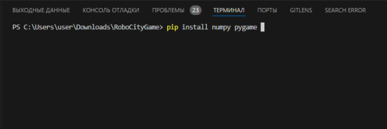
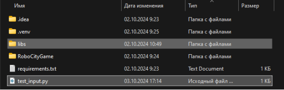
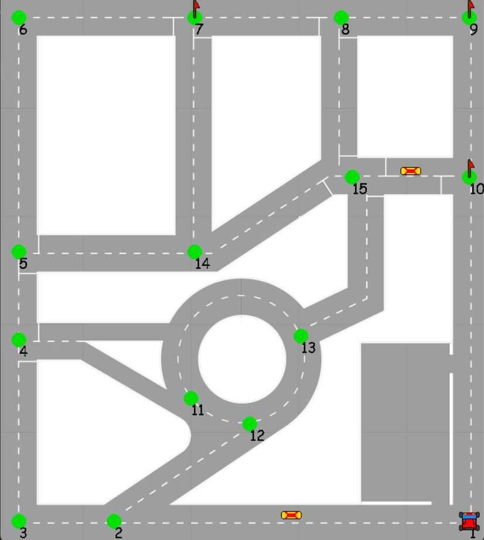

# Инструкция по использованию программы RoboCityGame - студенческий трек

## Введение

RoboCityGame (RCG) — это программа, предназначенная для участия в конкурсе «Роботы в городе». Она помогает вам отработать алгоритмы управления роботом на колёсной платформе. С помощью RCG вы сможете проверить, насколько эффективно ваш алгоритм управляет роботом, а также увидеть, как он движется по карте.

## Структура программы

Программа состоит из трёх основных модулей:
1. robocitygame.py — отвечает за создание объектов, симуляцию и оценку результатов.
2. robocitydisp.py — отвечает за графическое отображение элементов.
3. completion_test.py — находит циклы, которые проходят через все узлы графа ровно один раз и возвращаются в начальное положение.

## Подготовка к работе

Чтобы программа работала корректно, вам нужно установить две библиотеки: pygame и numpy. Информация об этом содержится в файле `requirements.txt`.

Установка
	
Для работы с Python-программой необходимо установить среду разработки и сам python версии 3.9 или выше. Python можно скачать здесь:
https://www.python.org/downloads/

 В качестве сред разработки можно использовать, например, следующие среды:
- VisualStudioCode - https://code.visualstudio.com/

- Pycharm Community - https://www.jetbrains.com/pycharm/download/

Если Вам удобнее использовать другие редакторы кода, то можете использовать их. Предложенные выше редакторы являются рекондацией, а не требованием. Далее считается, что Вы установили Python и редактор кода.
1. Откройте редактор и в терминале установите библиотеки pygame и numpy:

2. Поместите папку `libs` в ту же директорию, где находится основной файл программы.

3. Добавьте в свой python-код следующую строку:
from libs import robotcitygame as rcg
Теперь RCG готов к работе!

## Описание классов

В RCG используются два основных класса:
- Graph — описывает карту города (треки конкурса).
- Rover — описывает поведение робота.
Класс Graph:
- Представляет собой направленный граф, где узлы — это перекрёстки (Рисунок 1);
- Содержит информацию о доступности узлов и расстояниях между ними;
- Метод put_obstacle позволяет добавлять препятствия на графе.

Класс Rover:
1. Связан с объектом Graph и содержит информацию о текущем положении и ориентации робота.
2. Методы для изменения положения и ориентации:
- mov_to_point — перемещение к заданной точке;
- rotate — изменение ориентации.
3. Основные функции движения:
- go_forward()
- rotate()

## Управление роботом

Вот основные функции, которые вы будете использовать для управления роботом:
1. Инициализация игры
    `school_graph, model, can_be_completed = rcg.init_game(start_pos, start_rot, blocks, flags)`
- start_pos — начальная позиция робота (номер узла).
- start_rot — начальная ориентация (градусы, 0 - направление "на восток", от узла 1 к узлу 2).
- blocks — информация об других участниках дорожного движения, указывается между какими точками находиться участник (например, [[1, 2], [3, 4]]). Опциональный параметр.
- flags — информация об узлах, посещение которых обязательно (например [1, 2, 13]). Опциональный параметр.
1. Перемещение робота
- model.fo_forward() — двигаться вперёд;
- model.rotate(angle) — повернуться на некоторый угол angle;
1. Завершение игры и оценка
`rcg.finalize(mode, graph, model)` 
Эта функция рассчитывает баллы за выполнение задания и выводит график движения. Баллы рассчитываются исходя из режима mode, о котором написано ниже.

## Режимы программы

Программа способна работать в двух режимах - это режим прохождения всего трека ***roundabout*** и режим проезда по определённым точкам ***capture_flag***.

### Roundabout

Цель - проехать наикратчайшим путём по всем узлам трека, посетив каждый узел всего 1 раз.

### Capture_flag

Цель - проехать по выделенным точкам наикратчайшим маршрутом.

## Пример программы

Вот пример, как может выглядеть ваша программа с использованием RCG в режиме roundabout:

    from libs import robositygame as rcg

    graph, model, com_flag = rcg.init_game(1, (0 % 360), [[4, 5], [8, 15]])
    if com_flag:
        # Начало команд программиста
        model.go_forward()
        model.go_forward()
        mode.rotate(-90)
        model.go_forward()
        mode.rotate(-90)
        model.go_forward()
        model.go_forward()
        model.go_forward()
        mode.rotate(-90)
        model.go_forward()
        mode.rotate(90)
        model.go_forward()
        model.go_forward()
        mode.rotate(-90)
        model.go_forward()
        mode.rotate(-90)
        model.go_forward()
        model.go_forward()
        model.go_forward()
        mode.rotate(-90)
        model.go_forward()
        model.go_forward()
        #Конец команд 
    else:
        print("This track cannot be completed! Change base_info!")
    rcg.finalize(mode='roundabout', model=model, graph=graph)
    
Вот пример, как может выглядеть ваша программа с использованием RCG в режиме capture_flag:

    from libs import robositygame as rcg

    graph, model, com_flag = rcg.init_game(1, (270 % 360), [], [10, 9, 7])
    if com_flag:
        # Начало команд программиста
        model.go_forward()  
		model.rotate(90)  
		model.go_forward()  
		model.rotate(-90)  
		model.go_forward()  
		model.rotate(-90)  
		model.go_forward()
        #Конец команд 
    else:
        print("This track cannot be completed! Change base_info!")
    rcg.finalize(model=model, graph=graph)

Для запуска симуляции нужно нажать `Пробел`.

## Заключение

Теперь вы знаете, как использовать RoboCityGame для симуляции конкурса «Роботы в городе». 

Удачи в разработке вашего алгоритма и успешного участия в конкурсе!